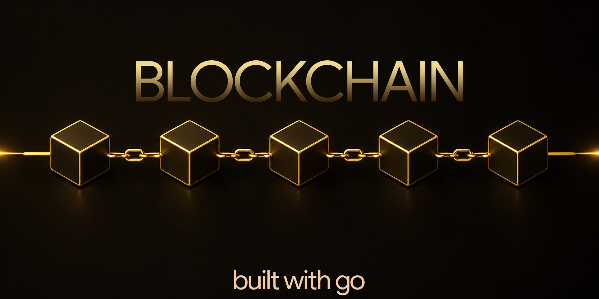

# Go Blockchain

  

A blockchain implementation written in Go to explore the core concepts behind cryptocurrencies and distributed ledger technology. This project was built as a hands-on learning exercise, covering block creation, Proof of Work, wallets, digital signatures, transaction validation, and the UTXO transaction model.

## Features

* Block creation and blockchain persistence
* SHA-256 hashing
* Proof of Work (PoW)
* Persistent storage using BadgerDB
* UTXO-based transaction model
* Wallet generation using ECDSA key pairs
* Transaction signing and verification
* Persistent UTXO set for efficient transaction lookups
* Command-line interface for interacting with the blockchain

This project is intended for educational purposes and focuses on understanding how blockchain systems work internally rather than serving as a production-ready cryptocurrency.
